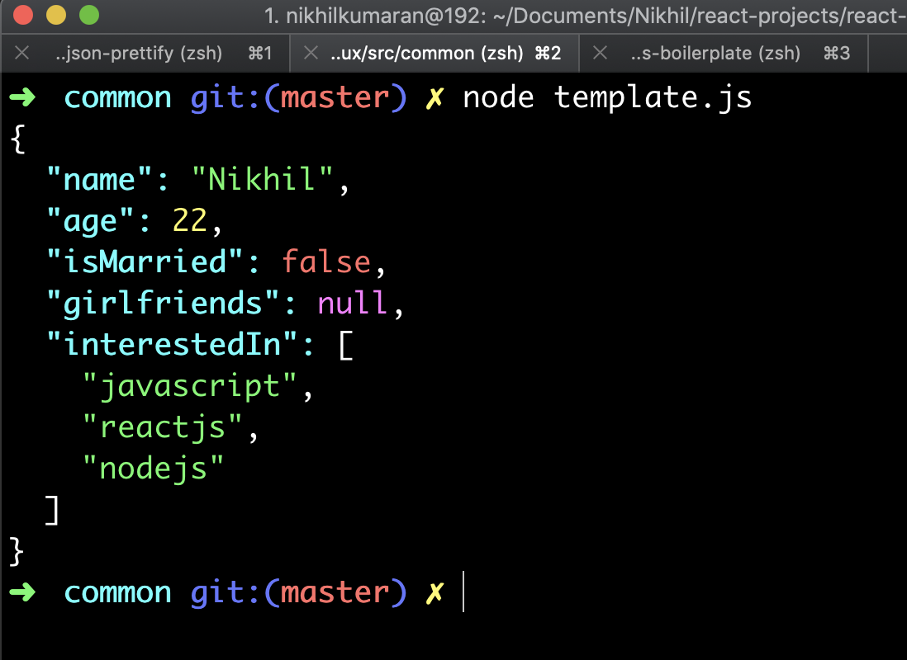

# beautify-json

Beautify JSON with colors and indentation and print it on terminal

## Installation

```bash
npm install beautify-json
```

## Usage

```javascript
const { jsonBeautify } = require('beautify-json')

let your_object = {
    name: 'Nikhil',
    age: 22,
    isMarried: false,
    girlfriends: null,
    interestedIn: [
        'javascript',
        'reactjs',
        'nodejs'
    ]
}

jsonBeautify(your_object) //It will beautify your object with colors and proper indentation and display it on the terminal
```



## Why choose beautify-json?

Minimal footprint. The only dependency that I used is `chalk` for colors.

The underlying approach is to use `JSON.stringify`. I have also added a condition to treat regular expressions as strings, else `JSON.stringify` will serialize them as empty objects.
